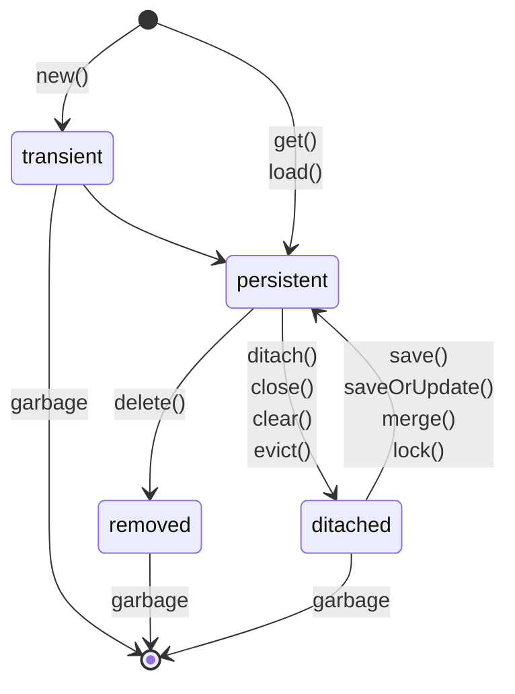

## Draft

Before JPA jdbc was used. but that required a lots of queries. JPA needs the relationship mapping between class objects and tables & do the rest.
Objects which will be saved to database is called entity. anotated by @Entities.

JPA- The Java Persistence API (JPA) is a specification of Java. It is used to persist data between Java object and relational database. 
JPA acts as a bridge between object-oriented domain models and relational database systems. As JPA is just a specification, it doesn't perform any operation by itself.

Hibernate Lifecycle-

Annotations-
- @Id
- @Entity
- @Table
- @Column
- @Transient

Some keywords to explore more-
- EntityManager
- EntityManagerFactory
- Persistence class
- persistence-unit

## Gradle vs Maven
|Basis|	Gradle|	Maven|
|---------------|---------------|----------------|
|Based on	|Gradle is based on developing domain-specific language projects.|	Maven is based on developing pure Java language-based software.|
|Configuration	|It uses a Groovy-based Domain-specific language(DSL) for creating project structure.|	It uses Extensible Markup Language(XML) for creating project structure.|
|Focuses on	|Developing applications by adding new features to them.|	Developing applications in a given time limit.|
|Performance|	It performs better than maven as it optimized for tracking only current running task.|	It does not create local temporary files during software creation, and is hence – slower.|
|Java Compilation	|It avoids compilation.|	It is necessary to compile.
|Usability|	It is a new tool, which requires users to spend a lot of time to get used to it.|	This tool is a known tool for many users and is easily available.|
|Customization|	This tool is highly customizable as it supports a variety of IDE’s.	|This tool serves a limited amount of developers and is not that customizable.|
|Languages supported|	It supports software development in Java, C, C++, and Groovy.|	It supports software development in Java, Scala, C#, and Ruby.|

Some resources
- https://www.baeldung.com/spring-data-annotations
- https://www.baeldung.com/jpa-entities

- https://www.javatpoint.com/jpa-jpql-introduction
- https://www.javatpoint.com/jpa-criteria-api-introduction

- https://spring.io/guides/gs/accessing-data-jpa/
- https://spring.io/projects/spring-data-jpa

- https://www.geeksforgeeks.org/difference-between-gradle-and-maven/
- https://medium.com/nerd-for-tech/jpa-is-a-standard-for-orm-4dd2c4dafe8a

Spring initializer
https://www.geeksforgeeks.org/spring-initializr/#:~:text=Spring%20Initializr%20is%20a%20Web,the%20Spring%20Boot%20project%20structure.&text=The%20Spring%20Initializr%20tool%20takes,added%20based%20on%20the%20version).

ORM- object relational mapping  
ORM stands for Object-Relational Mapping (ORM) is a programming technique for converting data between relational databases and object oriented programming languages such as Java, C#, etc.
https://docs.spring.io/spring-framework/docs/2.5.x/reference/orm.html
https://www.tutorialspoint.com/hibernate/orm_overview.htm
