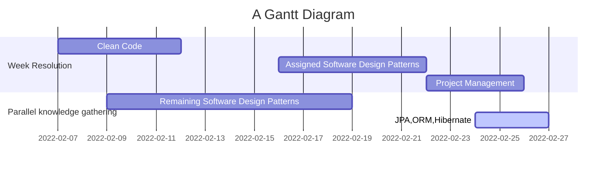

# Project Management
## Requirements analysis
- functional
- non functional
------------------
- business requirement
- software requirement

Techniques for Identifying Software Requirements
- Data Flow Diagram
- Use Cases
- User Stories

## Task breakdown
## Effort estimation
- time it will take to complete that task

**Three-Point Method**  
This method loops in the best-case scenario, the worst-case scenario, and the most likely scenario. The average of all these estimates is then calculated to give us the final estimate.

In this method, the team needs to measure time/effort based on the following parameters:

- Optimistic Value (O): How much time/effort will it take if everything is on track?
- Pessimist Value (P): How much time/effort will it take if things fall apart or there are impediments on the way?
- Most Likely Value (M): What is the most likely and practical estimate to complete the task?
----------------

**Who is Involved in Agile Estimation Activity?**  
Agile development team should be involved. reasons-
- Everyone should be involved to ensure they know the user story demands and the corresponding estimation.
- To avoid underestimation or overestimation.

## Task prioritization (use case, multiple overlapping tasks)
**MoSCoW method** segments features based on 
- must-haves, 
- should-haves, 
- could-haves 
- won’t-haves.
-----------------------
- Write everything down: Personal and work tasks should be captured in one place.
- Evaluate long-term goals: Consider your larger long-term goals, and the work you need to do to reach them. 
- Break down larger goals: To understand how to achieve your long-term goals, break them down into yearly, monthly, and weekly achievements. 
- Create clear deadlines: Give yourself full visibility of deadlines, and create deadlines for yourself when none are formally required. 
- Employ the urgent-versus-important method: Prioritize urgent and important tasks; set a specific time to work on important nonurgent tasks; and delegate or remove all other tasks. 
- Create a daily MIT (Most important Task) list: Write down three important tasks that should be done that day. These tasks should always relate to your larger, future goals. 
- Avoid distractions: Intentionally steer clear of competing tasks, especially as task difficulty increases. 
- Consider effort: When your task list is becoming too much, prioritize according to effort and breeze through those easier tasks more quickly.

## Task or project timeline/ gantt chart design

A timeline is a representation of a list of events in sequential order. It is typically a visual design presenting a long bar named with dates paralleling it, and normally contemporaneous events; a Gantt chart is a form of timeline adopted in project management.

In contrast, a Gantt chart is a graphic/visual representation of your project timeline that gives project tasks related to time. Specific tasks are represented as horizontal bars, and the length of the bar designates how long that task is assumed to take.

-------------------------

## UML diagram
- sequence diagram 
- use case
- state machine
- activity
## Flowchart

## Flowchart vs Activity diagram
|-| Flowchart | Activity Diagram |
|-|------------------|------------------|
|Definition| A flowchart is a diagrammatic representation that illustrates a solution model to a given problem.|An activity diagram is a graphical representation of workflows of stepwise activities and actions with support for choice, iteration, and concurrency.|
|Usage|A flowchart helps to analyze and design a program. | an activity diagram helps to understand the business process or workflow of the system. |
|Association|A flowchart is associated with programming.| An activity diagram is associated with UML.|

## Tools can be used for project management
- [ClickUp](https://clickup.com/blog/)
- [Monday.com](https://monday.com/)
- [UML diagram tool - creately](https://creately.com/lp/uml-diagram-tool/)

## Diagram tool Mermaid syntax
- https://mermaid-js.github.io/mermaid/#/

## Reference
- [requirement analysis- visual paradigm](https://www.visual-paradigm.com/guide/requirements-gathering/requirement-analysis-techniques/#:~:text=Requirement%20Analysis%2C%20also%20known%20as,requirements%20gathering%20or%20requirements%20capturing.)
- [Flowchart vs Activity diagram](https://pediaa.com/what-is-the-difference-between-activity-diagram-and-flowchart/)
- [Task Prioritization](https://www.wework.com/ideas/professional-development/creativity-culture/how-to-prioritize-work#:~:text=Thoughtful%20prioritization%20typically%20involves%20creating,tasks%20for%20urgent%20must%2Ddos.)
- [Task Prioritization in agile](https://www.netsolutions.com/insights/how-to-estimate-projects-in-agile/)
