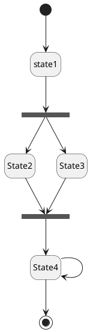

List of UML Diagram Types
So what are the different UML diagram types? There are two main categories; structure diagrams and behavioral diagrams. Click on the links to learn more about a specific diagram type.

- Structure Diagrams
    - Class Diagram (todo)
    - Component Diagram 
    - Deployment Diagram
    - Object Diagram
    - Package Diagram
    - Profile Diagram
    - Composite Structure Diagram  
- Behavioral Diagrams
    - Use Case Diagram (todo)
    - Activity Diagram (todo)
    - State Machine Diagram (todo)
    - Sequence Diagram (todo)
    - Communication Diagram
    - Interaction Overview Diagram
    - Timing Diagram

## Use Case Diagram
Use case diagrams give a graphic overview of the actors involved in a system, different functions needed by those actors and how these different functions interact.

## State diagram
- Initial state
- Transition
- State
- Fork 
- Join
- Self transition
- Composite state
- Final state

## References :
- [UML Diagram Types Guide](https://creately.com/blog/diagrams/uml-diagram-types-examples/)
- [sequence diagrams](https://www.geeksforgeeks.org/unified-modeling-language-uml-sequence-diagrams/?ref=lbp)
- [state diagram](https://www.geeksforgeeks.org/unified-modeling-language-uml-state-diagrams/?ref=lbp)
- [activity diagram](https://www.geeksforgeeks.org/unified-modeling-language-uml-activity-diagrams/?ref=lbp)

## plantuml diagram reference :
- [State Machine Diagram](https://plantuml.com/state-diagram)
- [Use Case Diagram](https://plantuml.com/use-case-diagram)
- [Activity Diagram](https://plantuml.com/activity-diagram-legacy)
- [Sequence diagram](https://plantuml.com/sequence-diagram)

